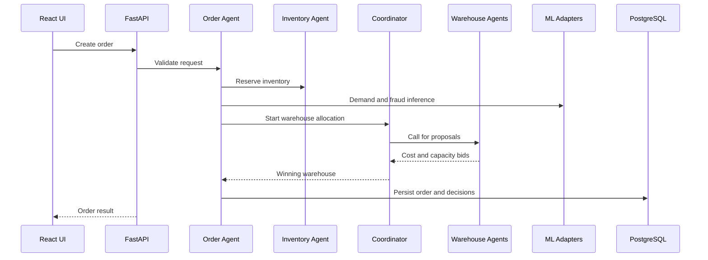
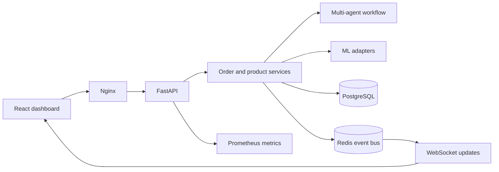

# FulfillCrew（智仓通）

[](https://github.com/Jeffhan789/FulfillCrew/actions/workflows/ci.yml)


FulfillCrew is a multi-agent order fulfilment system that connects a React operations dashboard, FastAPI services, a Contract Net Protocol warehouse workflow, persistence, observability, WebSockets, and ML inference adapters.

中文说明见[下文](#中文说明)。

## Why it exists

Most small commerce demos stop when checkout succeeds. FulfillCrew models what happens next: inventory validation, demand estimation, fraud scoring, warehouse bidding, allocation, fulfilment status, and real-time updates.

The project is designed as a readable engineering reference. It keeps the full path runnable with deterministic fallbacks while leaving clear extension points for trained models and external infrastructure.

## Implemented capabilities

- React 18 + TypeScript dashboard with product search, basket checkout, and order status.
- FastAPI endpoints for products, orders, agents, health, metrics, and WebSocket updates.
- PostgreSQL persistence through SQLAlchemy repositories.
- Redis-backed event distribution with an in-memory fallback for local use.
- Contract Net Protocol warehouse bidding coordinated by specialised agents.
- Demand prediction, fraud detection, and product classification adapters.
- Graceful fallback behaviour when optional ML artifacts are unavailable.
- Structured logs, Prometheus metrics, health checks, Docker Compose, and CI.
- A Node.js data-cleaning pipeline for noisy product records.

## Order flow



## Architecture



## Quick start

Requirements: Docker Engine 24+ and Docker Compose 2.20+.

```bash
cp .env.example .env
docker compose up --build -d
docker compose ps
```

Open:

- Frontend: <http://localhost>
- Backend API: <http://localhost:8000>
- Swagger UI: <http://localhost:8000/docs>
- Health check: <http://localhost:8000/health>
- Metrics: <http://localhost:8000/metrics>

Stop the stack with `docker compose down`.

## Local development

Backend:

```bash
python3 -m venv .venv
source .venv/bin/activate
pip install -r backend/requirements.txt
uvicorn backend.main:app --reload --port 8000
```

Frontend:

```bash
cd frontend
npm ci
npm run dev
```

The development Compose file provides hot reload with the same service boundaries:

```bash
docker compose -f docker-compose.dev.yml up --build
```

## Verification

```bash
PYTHONPATH=. pytest tests/ -q

cd frontend
npm ci
npm test
npm run build

cd ..
node data_cleaning/data_processing.js \
  data_cleaning/raw_products/products.json \
  data_cleaning/cleaned_products/products.json

docker build -t fulfillcrew-backend .
```

GitHub Actions runs backend tests, frontend tests and build, production dependency audit, data-cleaning verification, and Docker image build as separate required jobs.

## Project layout

```text
backend/          FastAPI routes, services, agents, repositories, infrastructure
frontend/         React + TypeScript dashboard and WebSocket client
ml_models/        Train, evaluate, and inference adapters for three model families
data_cleaning/    Reproducible product-data cleaning pipeline
tests/            Backend, workflow, ML fallback, and smoke tests
docs/             System design, ADRs, technical guides, and learning paths
```

## Engineering boundaries

- The included records and model inputs are synthetic demonstration data.
- ML fallbacks keep workflows reproducible; they are not claims of production model accuracy.
- Docker Compose targets local and single-host environments, not multi-region production.
- Authentication and tenant isolation remain future work; do not expose this stack directly to the public internet.

## Documentation

- [System design](docs/system_design.md)
- [Architecture decision records](docs/adr/README.md)
- [Technical guide](docs/technical_guide/README.md)
- [Learning path](docs/learning_path/README.md)
- [Industry-informed roadmap](docs/roadmap_industry_pain_points.md)

## 中文说明

FulfillCrew（智仓通）是一个多智能体订单履约系统，将 React 运营看板、FastAPI 服务、合同网协议仓库竞价、PostgreSQL 持久化、Redis 事件分发、WebSocket 实时更新和 ML 推理适配器组合在同一条可运行链路中。

项目重点关注结账之后的工程过程：库存校验、需求预测、欺诈评分、仓库竞价、订单分配、状态持久化与实时反馈。可选模型不可用时，系统会采用确定性降级逻辑，确保本地演示和自动测试仍可复现。

当前版本适合本地学习和单机演示，不包含完整认证、多租户隔离或多区域部署。仓库内数据均为合成数据，模型结果不代表生产环境精度。

## Roadmap

- Add authentication, tenant boundaries, and rate limiting.
- Persist event delivery with an outbox and replay mechanism.
- Publish model cards with dataset provenance and evaluation baselines.
- Add end-to-end browser tests and a repeatable load-test profile.
- Provide Kubernetes manifests only after operational requirements are measured.

## Contributing

Issues and pull requests are welcome. Please keep changes covered by tests and document architecture changes with an ADR.

## License

[MIT](LICENSE)
